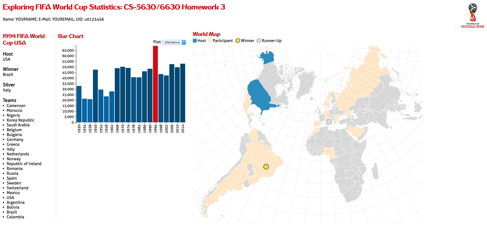
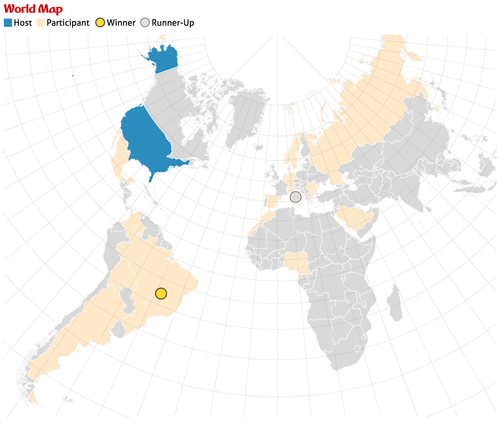

# CS-5630 / CS-6630 Homework 4
*Due: Friday, September 22, 11:59 pm.* 

In this assignment you will create a bar chart, a map, and an info panel that are linked to each other and display statistics from Fifa World Cup Games dating back to 1930. We've retrieved the data from [FIFA's website](http://www.fifa.com/fifa-tournaments/statistics-and-records/worldcup/).


## Visualization design

We are going to compare several attributes (such as attendance, number of teams, number of goals) of every World Cup since 1930. We are also going to visualize all the information for specific years using the map and info panel. 

The **bar chart** will allow us to see the evolution of attendance, total number of goals, the number of games, and the number of participating countries over the years. 

The **world map** will highlight the host country, all participating  countries, as well as the gold and silver medal winners. 

The **info panel** will display host, winner and runner-up, and show a list of all participants.

The bar chart will act as our way to select a particular world cup: by clicking the bar associated with the year, the map and the info box will display the data associated with that world cup. 

Your final visualization should look roughly like the figure below: 



## Implementation

We have provided boilerplate code that you should use to develop your solution.

As in previous homeworks, add your name, your e-mail address, and your UID to the HTML elements at the top. Also make sure your submission is a valid HTML5 file. Check that it is valid by uploading it to the [W3C HTML Validator](https://validator.w3.org/#validate_by_upload).

Other than adding your name, etc., you shouldn't need to edit hw4.html in this assignment (though you are free to optimize positioning, etc.)

Your project structure looks like this:

    hw4/
        hw4.html
        js/ 
            #you'll be doing most of your work in these files 
            barChart.js
            infoPanel.js
            map.js
            script.js # 
        styles.css
        assets
        data/
        	fifa-world-cup.csv
        	world.json
        assets/
        	# various assets
        figs/
        	# figures / videos used in the description
        	# irrelevant for the project
        
        	   
Remember, to be able to access the data files with javascript, you will need to be *serving* the homework directory, not just opening the HTML file in a browser. If your development environment doesn't already launch a server for you, you can start one with:

    cd path/to/hw4
    # python 2
    python -m SimpleHTTPServer
    # python 3
    python -m http.server

And you can view the page at [http://localhost:8080](http://localhost:8080)

## About the classes

Notice that we are using classes to represent each of the visual components of the HW. We have provided the class skeletons, and you will be filling in the necessary functions. 

## About the data

We have taken care of the data loading for you in the homework skeleton, in `script.js`. We're reading in the data from the `fifa-world-cup.csv` file and the map from the `world.json` GeoJSON file. 

The data (allData variable) contains all the attributes you will need.
To better understand the structure of the data it's a good idea to look at the files and log the data objects to the console. Also take a closer look at the call to `d3.csv()` in the provided `script.js` file.

## Part I: Bar Chart

Your first task is to fill in the ``updateBarChart(selectedDimension)`` function. Create a bar chart that displays one of the numerical dimensions associated with each World Cup:

 * Average Attendance
 * Number of Goals
 * Number of Games
 * Number of Participants

Implement your bar chart such that it displays the dimension specified in the `selectedDimension` parameter.

Make sure to include x and y axes, with tick labels and use the proper d3 scales and axis. 

Next, color each bar based on the selected data attribute (both height and color should encode the selected attribute); define and use the ``colorScale`` variable. 

### Updating The Bar Chart

Make your bar-chart update the data it shows depending on the selection of the drop-down box, which calls `updateBarChart()` with the new `selectedDimension`. 
When you're done with this part, your bar chart should behave like this: 


## Part II: Selecting a Word Cup

In the `updateBarChart()` function, there is one location flagged with 

    // ******* TODO: PART II*******

Here, you should make your bars respond to click events. This involves highlighting the selected bar with a different color, and calling the map update and info panel update functions while passing the selected world cup event to them. 

## Part III: Info Panel 

Now that these updates are triggered, your next task is to update the text fields in the info panel on the left using the selected world cup. Show the following attributes of the selected year: World Cup Title ('EDITION' attribute of the data object), host, winner, runner_up, and a list of the participating teams. 


## Part IV: Create Map

On to the map. Start by filling in ``drawMap()`` to draw the background. We have provided you with the projection, including the scaling and translation necessary to center it in the designated map area. 

Because we will be handling different countries independently, it is important how we create and keep track of each path element!

Note that in the .css styles provided in styles.css, we have provided the following classes: 

```css
.countries {
	stroke: #f7f7f7;
	fill: #d9d9d9;
	}
   .team {
   		fill: #fee8c8;
   }
   .host {
      fill: #2b8cbe;
	}
```

These classes are meant to facilitate the task of styling each country path element according to its role. As you may have guessed, all the country path elements should be assigned the countries class. We will use the other two classes when updating the map. 
 
Another important task is going to be styling specific countries (such as the host country) when updating the map for a selected year. Since there is only one of each country, we can use ids to tag them. The id field provided in the .json data might come in handy here! 
  

## Part V: Update Map

Update the map for a selected world cup, as triggered from the bar chart. 

Recall that the aspects we want to highlight are: 

 * participating countries, 
 * host country, 
 * winning team, 
 * runner up team. 

We want to use color to encode the participating and host country, and a marker to mark the winning team and runner up. This avoids the tricky situation of having to color a country in two colors, which would happen if the host wins, which happened a few times in history.
 
As mentioned in the createMap() stage, we have created classes to style the hosting country (.host) and the participating countries (.team). Make sure and take advantage of those to style the appropriate path elements. 

Here is the map as it should look like for the 1994 World Cup in the US:



When updating to another world cup, you fist have to clear the selections. Do this in the `clearMap()` function. This should remove highlights from countries and the markers representing winning teams. 

## DONE! 

Your final solution should behave something [like this](https://www.youtube.com/watch?v=s30Rp63AOkU)

## Extra Credit

Make all the countries respond to a click event by displaying a list of World Cups they participated in. Also display if they were ever winners or runner ups. Add this information to a new, separate panel.

## Grading

The rubrics on the assignment are:

35%: Part I: Bar chart shows current selection, with appropriate scales, axes, and coloring. Switching between the different attributes works.  
5%: Part II: Bars can be selected and are highlighted, the update functions for map and info panel are called with a single world cup object.  
20%: Part III: Text is properly displayed and updated in the info panel.
20%: Part IV: Map is properly rendered including proper class/id assignment to the path elements.  
20%: Part V: Map updates correctly when user selects a year in the barChart. This includes correct styling of colors and position of markers on the map.  
10%: Extra Credit: Countries respond to click event properly by displaying the correct information in a new panel  